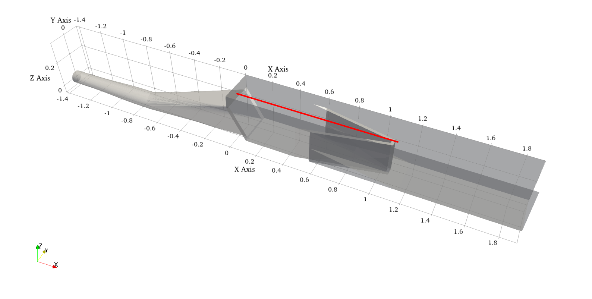
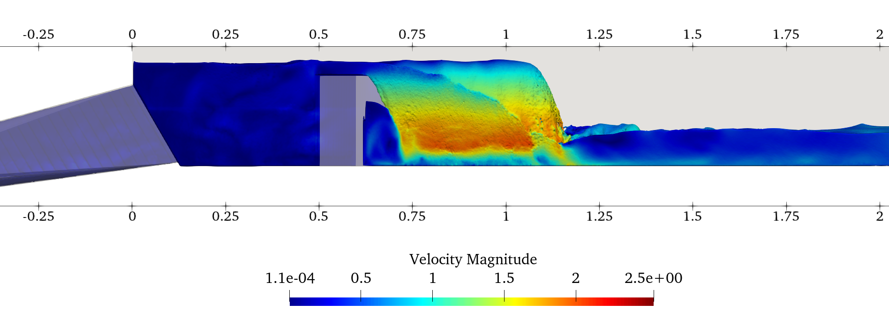

# Data k úloze

- První soubor `data_vysky_hladin.csv` obsahuje data výšek hladin ze simulace. Jednotlivé řádky odpovídají jednotlivým vyhodnocovaným časům. Sloupce potom odpovídají jednotlivým bodům v ose kanálu, kde byla výška vyhodnocována - tyto body rovnoměrně pokrývají interval [0, 1.048] (viz obrázek).

(_Data tedy tvoří matici, kde řádky zaznamenávají výšky v jednotlivých časech, kdy byla simulace vyhodnocena a sloupce odpovídají jednotlivým bodům, kde byla výška měřena. Data průměrujeme v čase, tedy děláme průměr všech řádků. Tím získáme průměrné výšky v jednotlivých bodech._)
- Druhý soubor `data_experiment.dat` obsahuje naměřené výšky hladin v několika bodech (první sloupec jsou souřadnice bodů, druhý sloupec výšky bodů). Experimentální data jsou převzata z [1].

#### Reference

[1] [M Sedlář et al 2020 J. Phys.: Conf. Ser. 1584 012070](https://iopscience.iop.org/article/10.1088/1742-6596/1584/1/012070)
